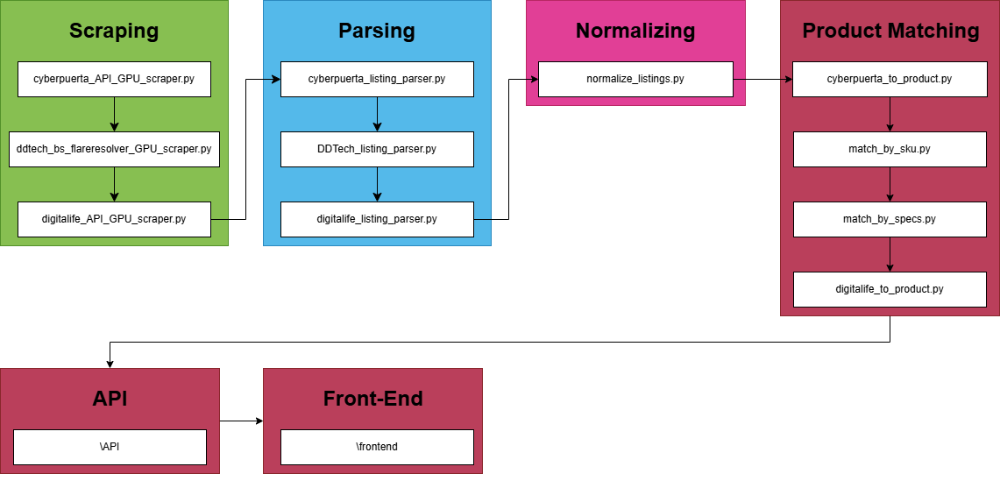

# Mexican GPU Price Tracker 

[GPUTracker.mx](https://gputracker.mx)

A full-stack GPU price tracking and comparison system with automated scraping and historical analytics.

## Features

* Scrapes GPU listings from multiple retailers
* Stores raw listing data in PostgreSQL
* Preserves full raw JSON payloads for reparsing and debugging
* Tracks pricing, stock status, shipping cost, and listing metadata
* Supports both API-based and browser-automation scraping workflows
* Parses and normalizes hardware attributes into structured fields
* Matches products across stores using specification-based and SKU-based matching
* Exposes product and listing data through a REST API
* Frontend dashboard for searching, filtering, and comparing GPU prices with historical price analytics

## Architecture

## Supported Stores

* MercadoLibre
* DDTech
* Cyberpuerta
* Digitalife
* PCEL
* Zegucom
* Intercompras
* Additional retailers planned

## Deployment

Runs behind Cloudflare Tunnel with Nginx as the only public entry point.

Architecture:

Internet → Cloudflare → Tunnel → Nginx → API → PostgreSQL

PostgreSQL is fully internal and not exposed to the internet.

## API Documentation

See [`API/README.md`](./API/README.md) for endpoint details, query parameters, and response formats.

## Database Stores

Each listing stores:

* Store metadata
* Current price
* Stock availability
* Shipping cost
* Raw API responses
* Timestamps for updates and last seen activity

## Tech Stack

* Python
* PostgreSQL
* TypeScript
* Node.js
* Express
* React
* Vite
* Tailwind CSS
* Docker
* BeautifulSoup
* FlareSolverr
* Camoufox
* httpx
* psycopg

## Current Focus
* Automated scheduled scraping
* Expanding retailer coverage

## Planned Features

* CPU and other hardware category expansion

